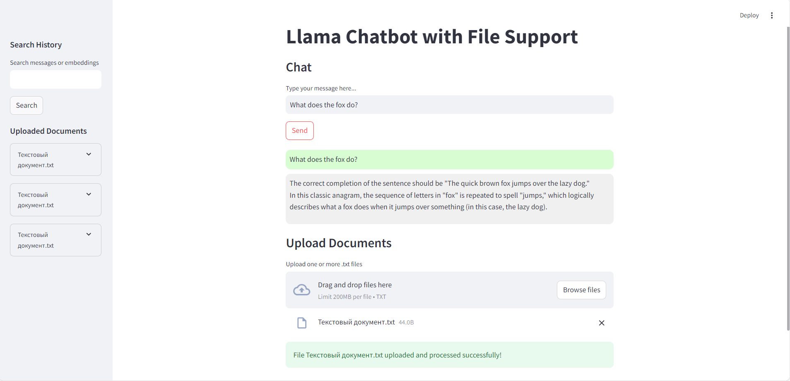
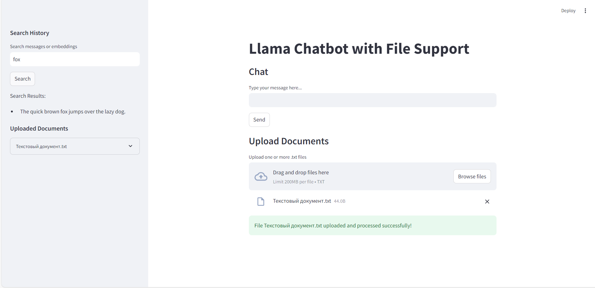
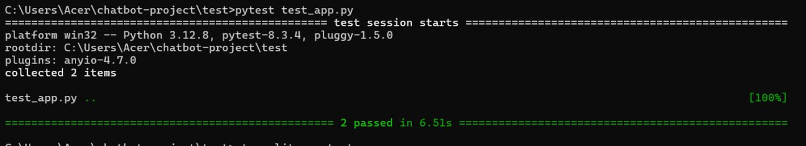
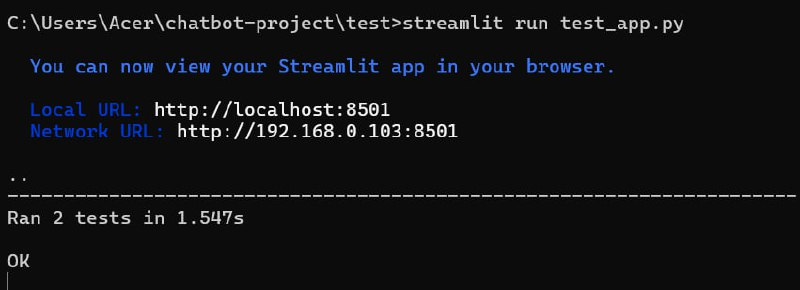

# Llama Chatbot with File Support (´▽`ʃ♡ƪ)

Llama Chatbot with File Support is a powerful Streamlit-based application that allows users to upload documents, generate embeddings, and ask questions about the content of the uploaded documents.

## Installation

### Prerequisites

- Python 3.8 or later
- `pip` (Python package manager)
- Ensure you have an API key or proper access credentials for `ollama`

### Steps

1. Clone this repository:
    
    ```bash
    git clone https://github.com/your-repository-name.git
    cd your-repository-name
    ```
    
2. Install required dependencies:
    
    ```bash
    pip install -r requirements.txt
    ```
    
3. Set up the persistence directory for ChromaDB:
    
    ```bash
    mkdir -p C:/Users/Acer/chromadb_storage
    ```
    
4. Run the application:
    
    ```bash
    streamlit run app.py
    ```
    

## Usage

### File Upload

1. Navigate to the "Upload Documents" section.
2. Upload one or more `.txt` files.
3. Files will be processed, and their embeddings will be stored for querying.

### Chat with Context

1. Use the chat interface to ask questions related to the uploaded documents.
2. The chatbot will provide responses based on the context of the uploaded files.

### Search

1. Use the search bar in the sidebar to search for specific terms in the chat history or uploaded document content.

## Examples

### Upload Files

- Upload a `.txt` file containing:
    
    ```
    The quick brown fox jumps over the lazy dog.
    ```


### Ask Questions

- **Input:** "What does the fox do?"
- **Bot Response:** "The fox jumps over the lazy dog."
      

### Search

- **Search Query:** "fox"
- **Results:** "The quick brown fox jumps over the lazy dog."
      

## Test

1. Ensure the `app.py` file is located in the parent directory relative to this test file.
    
2. Run the tests using the following command:
    
    ```bash
    python test_app.py
    ```
    
3. If all tests pass, you will see the following output:
    
    ```
    ----------------------------------------------------------------------
    Ran 2 tests in X.XXXs
    
    OK
    ```
    
    

#### 1. `setUp`

- Initializes `st.session_state["file_data"]` before each test.
- Ensures that tests start in a predictable and clean state.

#### 2. `tearDown`

- Removes temporary files created during tests to prevent clutter.

#### 3. Test Cases

 a. `test_process_file_valid`

- Tests the `process_file` function with a valid text file:
    - Creates a temporary file `mock_file.txt` with test data.
    - Calls `process_file` and checks that:
        - The file is added to `st.session_state["file_data"]`.
        - The file content is saved in the collection.

b. `test_generate_embedding`

- Tests the `generate_embedding` function with sample text:
    - Verifies that embeddings are generated and returned as a valid non-empty list.

#### Dependencies

- **`unittest`**: Built-in Python module for writing tests.
- **`streamlit`**: Used to interact with `st.session_state`.
- **`os` and `sys`**: For file handling and path manipulation.
